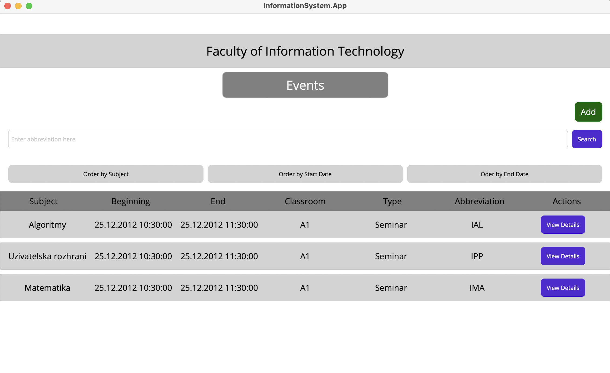

# ICS Project 2024 - School Information System
## Introduction
School Information System application created as a team project for C# course (ICS)  at VUT FIT. Complete task assignment is [here](https://github.com/nesfit/ICS/blob/f85ad106ab52b825aae60861d257fcfef0026b72/Project/README.md).

## Authors
- **Ondrej Kožányi** (xkozan01)
- **Marek Joukl** (xjoukl00)
- **Jakub Zelenay** (xzelen29)
- **Daniel Putiš** (xputis00)

## Instalation

```
cd InformationSystem
dotnet build
dotnet run --project InformationSystem.App
```

 ⚠️ Works only on Mac OS ⚠️

 ## Preview
    
