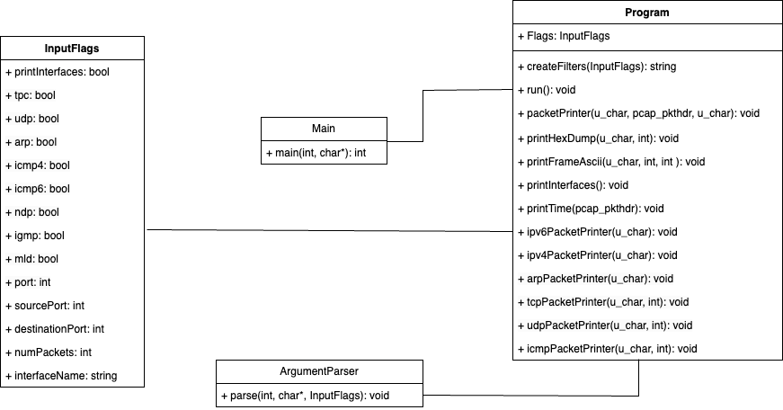

# IPK Project 2 2024 - ZETA: Network sniffer

### Author: Marek Joukl (xjoukl00)

The aim of this project was to design and implement a network analyzer that will be able to capture and filter packets on a specific network interface. 

**Table of contents**

- [Installation and usage](#installation-and-usage)
- [Output](#output)
- [Functionality description](#functionality-description)
- [Implementation details](#implementation-details)
- [Testing](#testing)
- [License](#license)
- [UML Diagram](#uml-diagram)
- [Bibliography](#bibliography)

## Installation and usage

After cloning the repository, you can build the project using command ``make``. This will create an executable file named ``ipk-sniffer``.  

For running the program, you might need to use *sudo*, as the program needs to access the network interface.

**Usage**:
```
./ipk-sniffer [-i interface | --interface interface] {-p|--port-source|--port-destination port [--tcp|-t] [--udp|-u]} [--arp] [--icmp4] [--icmp6] [--igmp] [--mld] {-n num}
```

| Option              | Description                                                                                                       |
|---------------------|-------------------------------------------------------------------------------------------------------------------|
| `-i` or <br> `--interface` | Specify a single interface to sniff. If not specified, or only `-i/--interface` is used without a value, a list of active interfaces is printed. |
| `-t` or `--tcp`     | Display TCP segments and optionally complemented by `-p` or `--port-*` functionality.                            |
| `-u` or `--udp`     | Display UDP datagrams and optionally complemented by `-p` or `--port-*` functionality.                            |
| `-p`                | Extend previous TCP/UDP filtering options by specifying a port number. If not present, no port filtering occurs; if specified, the port can occur in the source or destination part of TCP/UDP headers. |
| `--port-destination` | Extend previous TCP/UDP filtering options by specifying a port number. If not present, no port filtering occurs; if specified, the port can occur in the destination part of TCP/UDP headers. |
| `--port-source`  | Extend previous TCP/UDP filtering options by specifying a port number. If not present, no port filtering occurs; if specified, the port can occur in the source part of TCP/UDP headers. |
| `--icmp4`           | Display only ICMPv4 packets.                                                                                     |
| `--icmp6`           | Display only ICMPv6 echo request/response.                                                                      |
| `--arp`             | Display only ARP frames.                                                                                         |
| `--ndp`             | Display only NDP packets, subset of ICMPv6.                                                                      |
| `--igmp`            | Display only IGMP packets.                                                                                       |
| `--mld`             | Display only MLD packets, subset of ICMPv6.                                                                      |
| `-n`             | Specify the number of packets to display. If not specified, only one packet is displayed (equivalent to `-n 1`). |

All arguments can be provided in any order. All content, regardless of protocol, is considered for printing unless protocols are explicitly specified.

To exit the program, press `Ctrl+C`.

## Output
```
timestamp: time (RFC 3339 format)
src MAC: source MAC address
dst MAC: destination MAC address
frame length: length of the frame
src IP: source IP address
dst IP: destination IP address
src port: source port
dst port: destination port
byte_offset: byte_offset_hexa byte_offset_ASCII
```

## Functionality description

The program is able to capture packets on a specific network interface and filter them based on the specified parameters (see above). Here are some keywords necessary for understanding the functionality of the program:

* **Interface**: The program can capture packets on a specific network interface. Interface connects a device to a network, enabling it to send and receive data. It serves as the point of communication between the device and the network, facilitating data transmission and reception according to network protocols.

* **Packet**: A packet is a small amount of data sent over a network. Each packet includes the sender's address, the recipient's address, and a piece of the message being sent. The packet is the fundamental unit of information transmitted over a network.

* **Filtering**: The program can filter packets based on the specified parameters. Filtering can be based on various parameters, such as protocol type, port number, or packet content.

* **Protocol**: A protocol is a set of rules that govern the communication between devices on a network. Different protocols are used for different types of communication, such as sending email, browsing the web, or transferring files.

## Implementation details

The program is implemented in C++ using the C++20 standard. It begins by parsing command-line arguments, setting protocol flags to create filters, and initializing the packet capture session. For packet capture, the program utilizes the pcap library, offering functions for capturing and processing network packets. Key functions like pcap_open_live open live capture sessions on network interfaces, while pcap_loop captures and processes packets.

For filtering, the program uses the `pcap_compile` function to compile a filter expression and the `pcap_setfilter` function to apply the filter to the capture session. Filters are created using the ``createFilters()`` function.

Printing is done using the `packetPrinter()` function, which prints the packet information in the specified format. The program prints the timestamp, source and destination MAC addresses, frame length, source and destination IP addresses, source and destination port numbers, and the packet content.

## Testing

The functionality was tested on both MacOS and Linux. The program underwent testing on diverse network interfaces, capturing and filtering packets according to specified parameters. Testing involved running the program with various combinations of protocol flags, port numbers, and packet content to validate the functionality of the filtering process.
Also comparing the output with Wireshark was done to ensure the correctness of the output.

Here are some examples of the program's output:

``Test 1: print interfaces``
```
sudo ./ipk-sniffer -i

enp0s1
any
lo
bluetooth-monitor
nflog
nfqueue
dbus-system
dbus-session
```

``Test 2: wrong input``
```
sudo ./ipk-sniffer -i eth0 --wrong_input

ERROR: Invalid arguments
```

``Test 3: print 1 packet using ICMPv4 protocol``
```
sudo ./ipk-sniffer -i eth0 --icmp4 -n 1

timestamp: 2024-04-22T20:15:54.280+00:00
src MAC: 02:42:ac:11:00:02
dst MAC: 02:42:3e:79:33:63
frame length: 42 bytes
src IP: 172.17.0.2
dst IP: 192.168.0.1
src port: 1220
dst port: 12345

0x0000 02 42 3e 79 33 63 02 42  ac 11 00 02 08 00 45 00 .B>y3c.B ......E.
0x0010 00 1c df 68 00 00 40 11  2e ac ac 11 00 02 c0 a8 ...h..@. ........
0x0020 00 01 04 c4 30 39 00 08  5e 24                   ....09.. ^$

```
Test packets were sent using the hping3 tool.

## License

This project is licensed under the GNU General Public License v3.0 - see the [LICENSE](LICENSE) file for details.

## UML Diagram



## Bibliography

* TCPDUMP/LIBPCAP public repository: http://www.tcpdump.org/
* RFC 3339: https://www.rfc-editor.org/rfc/rfc3339
* Project assignment: https://git.fit.vutbr.cz/NESFIT/IPK-Projects-2024/src/commit/37357afdbc6121c70a9600803e009967eb5b97d7/Project%202/zeta/README.md
