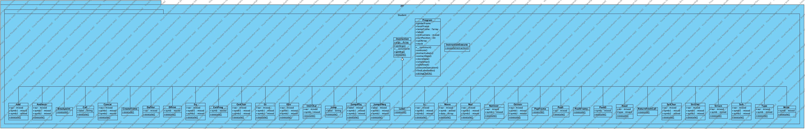

### Implemetační dokumentace k 2. úloze do IPP 20203/2024
Jméno a příjmení: Marek Joukl

Login: xjoukl00
<ol>
    <li> <h3> Obecný popis </h3> </li>
    <p> <code>Interpret.py</code> je skript, spouští a interpretuje kód. Jeho vstupem je kód v jazyce IPPcode24, který byl analyzován v první části úlohy a byl z něj vytvořen XML mezikód. Tato část úlohy měla za úkol tento XML mezikód interpretovat a spouštět.

<li> <h3> Popis metodiky </h3></li>
<p>Při implementaci pomocí objektově orientovaného programování (OOP) jsem využíval převážně mnohotvárnosti a dědičnosti k dosažení efektivní a modulární struktury kódu.</p>

<li> <h3> Implementace </h3></li>

Kód je spouštěn z předpřipravené třídy zavoláním funkce <code>execute()</code>, která nejprve načte zdrojový kód jako kořen a dále volá metody k jeho interpretaci.
<ol>
    <li> <h4> InstructionChecker </h4></li>
    <p>Tato třída má dvě hlavní metody. První, <code>regroupInstructions()</code>, přeuspořádá instrukce podle hodnoty <b>order</b>. Druhá, <code>checkInstructions()</code>, projde všechny instrukce a jejich argumenty a zkontroluje, zda jsou správně zapsány. V opačném případě jsou vráceny chybové hlášky na standardní chybový výstup.
    V průběhu kontroly jsou již zkontrolované instrukce ukládány do pole. Pokud nejsou chyby nalezeny, je toto pole vráceno. </p>
    <li> <h4> Program </h4></li>
    <p>S již zkontrolovaými instrukcemi dále pracuje hlaní třída Program, která má na starost interpertaci. Při vytváření instance jsou vytvořena pole pro zásobník, rámce, návěští a také další proměnné. Volání ostatních metod probíhá z metody <code>execute()</code> této třídy. Nejdříve jsou z instrukcí posbírány a uloženy návěští do pole <code>labels</code>. Dále jsou v cyklu  prácházeny instrukce uložené v globální proměnné <code>instructions</code> za pomoci globálního indexu právě zpracovávané instrukce <code>currPosition</code>a jsou volány jejich metody. Třída dále obsahuje řadu pomocných metod k usnadnění interpretace (např. <code>extractData()</code> pro získání dat z konstanty či proměnné, uložení dat funkcí <code>storeData()</code> nebo funkce <code>isValid()</code> a <code>isDefined()</code> pro ověření platnosti proměnných).</p>
    <li> <h4> Instruction </h4></li>
    <p>Tato abstraktní třída slouží jako prototyp jednotlivých instrukcí, které za pomoci dědičnosti a polymorfizmu implementují každá zvlášť funkci <code>execute()</code>. V sobě mají uložené své argumenty a dědí i metodu <code>getArgs()</code>, která zajišťuje přístup k jednotlivým argumentům. Pomocí předání parametrem se předává instance třídy <b>Program</b>, což je výhodné zejména při přistupování k aktuálně zpracovávané instrukci u skokových instrukcích. </p>
    <li> <h4> InstructionExecute </h4></li>
    <p>Tato třída je zodpovědná pouze za volání metod jednotlivých instrukcí a za předávání jejich parametrů. </p>
    <li> <h4> ErrorHandler a ErrCode</h4> </li>
    <p>Tyto třídy mají pouze jedinou funkci a to vypisování chybových hlášek společně s odpovídajícím číslem chyby. Ve třídě <code>ErrCode</code> jsou uloženy kódy chyb pro lepší čitelnost kódu, ve třídě <code>ErrorHandler</code> pak probíhá výpis.</p>
    </ol>

<li> <h3> UML Diagram tříd </h3></li>


</ol>

### Assignment [here](./ipp24spec.pdf)

```
⚠️ This code is missing the ipp-core structure of the project ⚠️
```